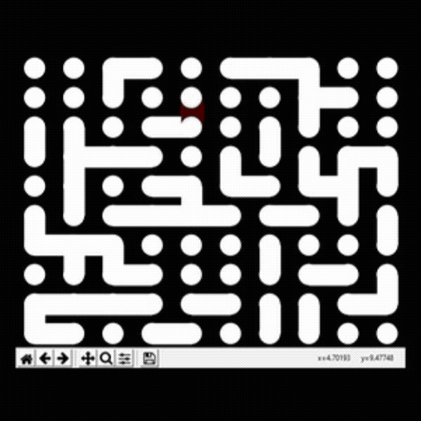
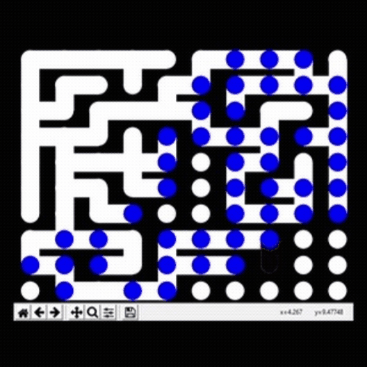
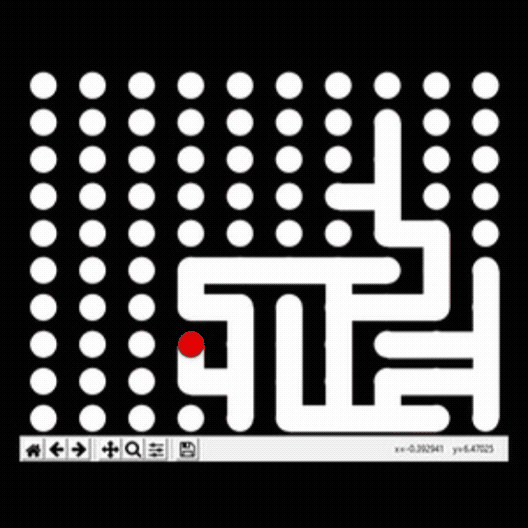
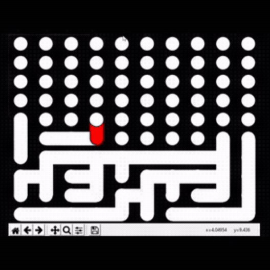
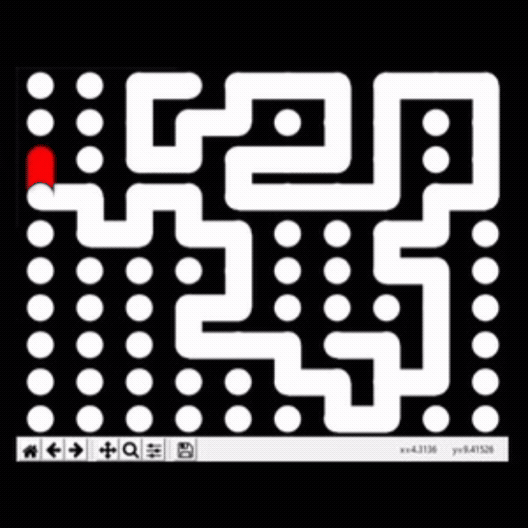

# Animation-Maze-Generation

Maze generation animation and analyser program, written by Alex Cummins for A-Level Extended Project.
Created in early 2018.

Please note all of the algorithms are implemented iteratively. 

The algorithms are:
* Prims
* Kruskals
* Recursive Backtracker
* Aldous-Broder
* Hunt and Kill
* Growing Tree
* Binary Tree

# Examples

Kruskals

Growing Tree

Aldous-Broder

Binary Tree

Hunt and Kill

# Requirements

* Python3
* Networkx
* matplotlib
* pylab

# Acknowledgements

* https://www.jamisbuck.org/mazes/

Jamis' website was invaluable in finding different maze generation algorithms, and giving the general algorithms which I was inspired by.
